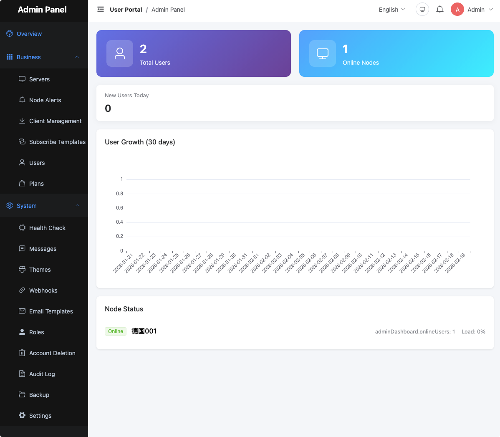

# EzPanel

**Language / 语言**: English | [简体中文](./README_CN.md) | [繁體中文](./README_TW.md) | [Русский](./README_RU.md) | [فارسی](./README_FA.md)

EzPanel is a full-featured proxy service user management panel that supports XrayM/XrayR node integration, providing complete user subscription management, plan management, node monitoring, and more.

---

## Documentation

| Document | Description |
|----------|-------------|
| [Installation](./docs/01_installation.md) | System requirements, installation steps, upgrade instructions |
| [Configuration](./docs/02_configuration.md) | Configuration file reference, per-module configuration |
| [Node Setup](./docs/03_node-setup.md) | XrayM/XrayR installation and configuration |
| [User Guide](./docs/04_user-guide.md) | Feature usage guide for end users |
| [Admin Guide](./docs/05_admin-guide.md) | Administrator backend operations |
| [Operations](./docs/06_operations.md) | Day-to-day operations, backups, monitoring |
| [Troubleshooting](./docs/07_troubleshooting.md) | Problem diagnosis and solutions |

---

> **Platform Note**: Full testing has only been performed on Arch Linux. The Debian / Ubuntu packages have not been validated on the platform due to time constraints, but should work in theory. Feedback is welcome.

---

## Editions

### Community — Free Forever

The Community edition includes core features for individual users, covering typical everyday usage. **Free forever, no expiration.**

- User management, subscription management
- Node management (XrayR/XrayM integration)
- Plan management
- System administration

> Community edition is closed-source software. No official technical support or customization is provided.

### Pro — Commercial License

Everything in Community, plus:

- Order / Invoice / Marketing management
- Payment gateway integration (Alipay, WeChat Pay, Stripe, etc.)
- Ticket system
- Knowledge base
- Referral / affiliate commission system
- Financial reports and analytics

### Enterprise — Commercial License

Everything in Pro, plus:

- SSH remote node management
- In-App Purchase (IAP) support

> Purchase Pro or Enterprise license at [https://opine.work](https://opine.work).

---

## Multi-Language Support

EzPanel ships with built-in internationalization. The following languages are supported out of the box:

| Language | Code |
|----------|------|
| 简体中文 (Simplified Chinese) | zh-CN |
| English | en |
| 繁體中文 (Traditional Chinese) | zh-TW |
| Русский (Russian) | ru |
| فارسی (Persian) | fa |

Users can switch languages from the top-right corner of the interface. After switching, reset email and subscription templates in **Admin → System Management** to apply the new language.

---

## Release Policy

- **Closed-source**: Source code is not publicly available.
- **Periodic updates**: New versions are released regularly with bug fixes and feature improvements.
- **Community edition**: Free forever with no feature expiration.
- **Announcements**: Follow [@OpineWorkPublish](https://t.me/OpineWorkPublish) on Telegram for release notifications.

---

## Legal & Compliance

EzPanel is a general-purpose user management panel. Users are solely responsible for ensuring that their deployment and use of this software complies with all applicable laws and regulations in their jurisdiction.

- **Lawful use only**: This software must not be used to facilitate any illegal activities, including but not limited to bypassing censorship in jurisdictions where doing so is prohibited, distributing prohibited content, or evading law enforcement.
- **User responsibility**: The operator is responsible for the conduct of end users on their platform and must implement appropriate terms of service, access controls, and monitoring.
- **No warranty**: The software is provided "as is." The developers disclaim all liability for damages arising from the use or misuse of this software.
- **Export controls**: Users must comply with applicable export control laws and regulations when deploying or distributing this software.

> By installing or using EzPanel, you agree that you have read, understood, and accepted these terms.

---

## Contact & Support

- **Website**: [https://opine.work](https://opine.work)
- **Telegram Channel**: [@OpineWorkPublish](https://t.me/OpineWorkPublish) (releases and announcements)
- **Telegram Group**: [@OpineWorkOfficial](https://t.me/OpineWorkOfficial) (community discussion)

> For special requirements or technical support, consider purchasing a Pro or Enterprise license.
