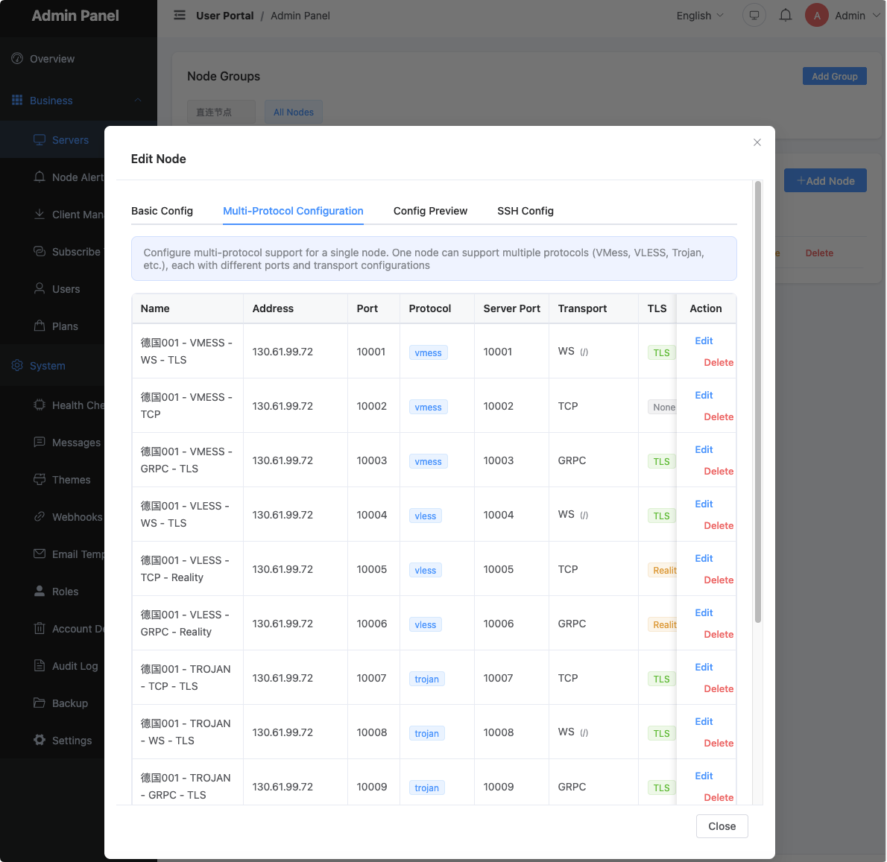
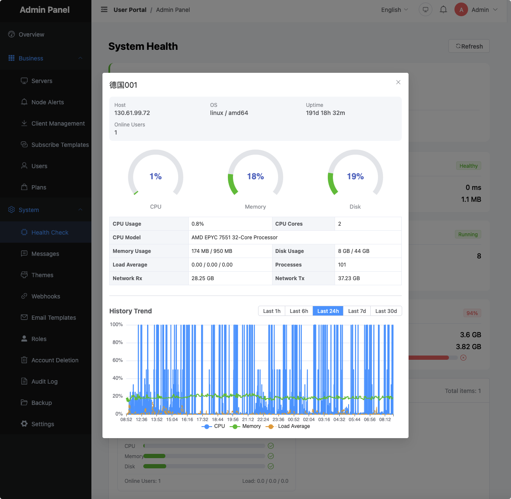

# Node Setup

**Language**: English | [简体中文](./03_node-setup_CN.md) | [繁體中文](./03_node-setup_TW.md) | [Русский](./03_node-setup_RU.md) | [فارسی](./03_node-setup_FA.md)

EzPanel supports two node clients: XrayM and XrayR. XrayM is recommended.



---

## XrayM vs XrayR Comparison

| Feature | XrayR | XrayM (Recommended) |
|---------|-------|---------------------|
| Multi-protocol support | Single process supports only one protocol | Single process supports multiple protocols simultaneously |
| Multi-port support | Each port requires a separate node | Single node with multiple ports |
| Node monitoring | Not supported | CPU / Memory / Network / Online users |
| Config management | Manual maintenance of multiple config files | Panel automatically distributes all protocol configs |
| Resource usage | Multiple processes required for multi-protocol | Single process, low resource usage |
| Hot reload | Not supported | Config changes take effect automatically without restart |

**Recommended scenarios**:
- Providing multiple protocols simultaneously (VMess + VLESS + Trojan, etc.)
- Real-time node monitoring required
- Simplified operations and reduced resource usage desired

---

## Creating a Node in the Panel

Go to **Admin Panel → System Management → Node Management** and click "Create Node":

### Basic Information

| Field | Description |
|-------|-------------|
| Node Name | Name displayed to users, e.g. "Hong Kong 01" |
| Node Address | IP address or domain name of the node server |
| Node Type | Select XrayM or XrayR |
| Node ID | Automatically assigned after creation; enter this into the node config file |

### Protocol Configuration (XrayM)

Switch to the "Protocol Configuration" tab and click "Quick Add Protocol" to select a preset combination:

| Combination | Included Protocols | Description |
|-------------|-------------------|-------------|
| Common Protocols | VMess(WS) + VLESS(WS) + Trojan(WS) + SS | Recommended; covers mainstream clients |
| VMess Suite | VMess(TCP/WS/gRPC) | Best compatibility |
| VLESS Suite | VLESS(TCP/WS/gRPC/REALITY) | Best performance |
| Trojan Suite | Trojan(TCP/WS/gRPC) | Good obfuscation |
| Shadowsocks | SS(AES-256-GCM / 2022-BLAKE3) | Lightweight |

> Ports are assigned automatically and can be modified manually after creation. Duplicate ports are skipped automatically.

---

## Installing XrayM

### Arch Linux

```bash
wget https://github.com/opinework/xraym/releases/latest/download/xraym-x86_64.pkg.tar.zst
sudo pacman -U xraym-*.pkg.tar.zst
```

### Debian / Ubuntu

```bash
wget https://github.com/opinework/xraym/releases/latest/download/xraym_amd64.deb
sudo dpkg -i xraym_*.deb
sudo apt-get install -f
```

### Generic Binary

```bash
wget https://github.com/opinework/xraym/releases/latest/download/xraym-linux-amd64.tar.gz
tar -xzf xraym-linux-amd64.tar.gz
sudo cp xraym /usr/bin/
sudo chmod +x /usr/bin/xraym
```

---

## Configuring XrayM

Copy the example config and edit it:

```bash
sudo cp /etc/xraym/config.example.yml /etc/xraym/config.yml
sudo nano /etc/xraym/config.yml
```

### Minimal Configuration (Automatic Mode, Recommended)

```yaml
Log:
  Level: warning

Nodes:
  - PanelType: "EzPanel"
    ApiConfig:
      ApiHost: "https://panel.example.com"   # Panel address
      ApiKey: "your-node-api-key"            # Node API key
      NodeID: 1                              # Node ID
    ControllerConfig:
      ListenIP: "0.0.0.0"
      UpdatePeriodic: 60
```

The `ApiKey` can be found in Admin Panel → System Settings → Node API Key.

### Multi-Node Configuration

```yaml
Log:
  Level: warning

Nodes:
  - PanelType: "EzPanel"
    ApiConfig:
      ApiHost: "https://panel.example.com"
      ApiKey: "your-node-api-key"
      NodeID: 1
    ControllerConfig:
      ListenIP: "0.0.0.0"

  - PanelType: "EzPanel"
    ApiConfig:
      ApiHost: "https://panel.example.com"
      ApiKey: "your-node-api-key"
      NodeID: 2
    ControllerConfig:
      ListenIP: "0.0.0.0"
```

### TLS Certificate Configuration

**Method 1: Local Certificate File**

```yaml
Nodes:
  - PanelType: "EzPanel"
    ApiConfig:
      ApiHost: "https://panel.example.com"
      ApiKey: "your-key"
      NodeID: 1
    ControllerConfig:
      ListenIP: "0.0.0.0"
      CertConfig:
        CertMode: "file"
        CertFile: "/etc/ssl/certs/node.crt"
        KeyFile: "/etc/ssl/private/node.key"
```

**Method 2: Automatic DNS Certificate (ACME)**

```yaml
ControllerConfig:
  CertConfig:
    CertMode: "dns"
    CertDomain: "node.example.com"
    Provider: "cloudflare"
    Email: "admin@example.com"
    DNSEnv:
      CF_API_EMAIL: "admin@example.com"
      CF_API_KEY: "your-cloudflare-api-key"
```

Supported DNS providers: `cloudflare`, `alidns`, `dnspod`, `namesilo`, and more.

### Auto Speed Limit Configuration

```yaml
ControllerConfig:
  UpdatePeriodic: 60
  AutoSpeedLimitConfig:
    Limit: 100         # Threshold (Mbps); 0 to disable
    WarnTimes: 3       # Number of consecutive threshold breaches before throttling (0 = immediate)
    LimitSpeed: 10     # Throttle speed (Mbps)
    LimitDuration: 30  # Throttle duration (minutes)
```

Trigger condition: `traffic in 60s > 100 Mbps × 60s × 125000 = 750 MB`

### Global Device Limit (Requires Redis)

```yaml
ControllerConfig:
  GlobalDeviceLimitConfig:
    Enable: true
    RedisAddr: "127.0.0.1:6379"
    RedisPassword: ""
```

---

## Starting XrayM

```bash
sudo systemctl enable --now xraym

# Check status
sudo systemctl status xraym

# View logs
sudo journalctl -u xraym -f
```

After a successful startup, the logs will contain output similar to:

```
INFO  XrayM started, node: Hong Kong 01 (ID: 1)
INFO  Inbound VMess:443 started
INFO  Inbound Trojan:8443 started
```

---

## Node Monitoring

XrayM automatically reports node status to the panel every 60 seconds.



**Monitored Metrics**:
- CPU usage
- Memory usage
- Disk usage
- Real-time network upload/download speed
- Number of online users
- Cumulative traffic statistics

**Where to view**: Admin Panel → System Management → Health Check

Click a node card to view detailed charts. Data refreshes automatically every 10 seconds.

> XrayR does not support node monitoring; it only reports traffic statistics.

---

## Using XrayR (Not Recommended)

> XrayR supports only one node, one port, and one protocol per process. Multiple protocols require multiple separate processes.

```yaml
# /etc/XrayR/config.yml
Log:
  Level: warning

Nodes:
  - PanelType: "NewV2board"
    ApiConfig:
      ApiHost: "https://panel.example.com"
      ApiKey: "your-node-api-key"
      NodeID: 1
      NodeType: V2ray     # V2ray / Trojan / Shadowsocks
      Timeout: 30
    ControllerConfig:
      ListenIP: 0.0.0.0
      UpdatePeriodic: 60
```

For multiple protocols, you must create a separate node and config file for each protocol and run multiple XrayR services.

---

## Generating a VLESS REALITY Key Pair

```bash
xraym x25519
```

Example output:

```
Private key: <base64-private-key>
Public key:  <base64-public-key>
```

Enter the Public key into the node protocol configuration in the panel. Keep the Private key on the server locally — it does not need to be entered into the panel.
